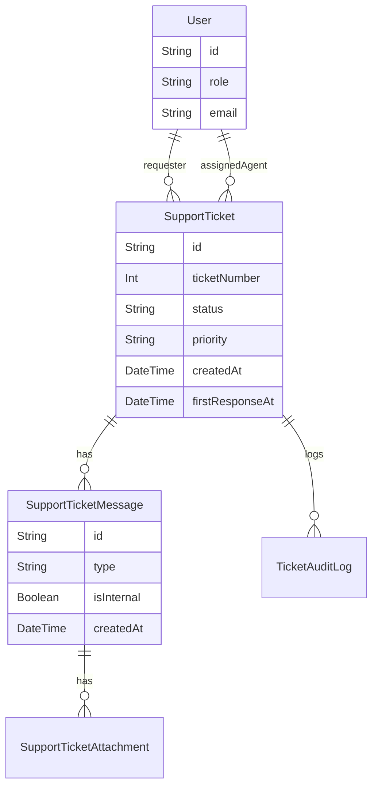
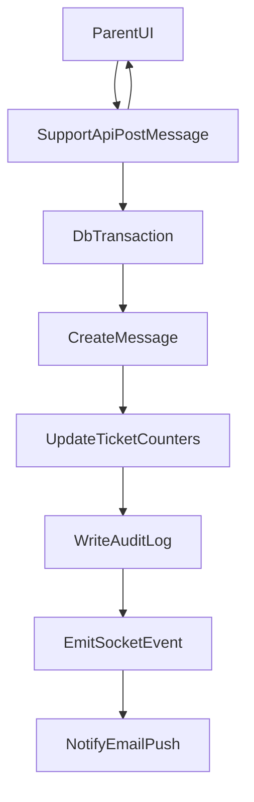

## Goals

- Deliver a **complete** support workflow: parent creates tickets → threaded conversation → admin triage/assignment/status → audit + SLA tracking → notifications → attachments.
- Keep it reliable in your current architecture: **Next.js App Router**, **Prisma/Postgres**, existing **admin ticket APIs** and existing **Socket.IO server** in `server.js`.

## Current baseline in repo (what we’ll extend)

- **DB model exists**: `SupportTicket` in `prisma/schema.prisma`.
- **Admin APIs exist**: `src/app/api/admin/tickets/route.js` (GET list, PUT update status/priority).
- **Admin UI exists**: Support tab in `src/app/[locale]/admin/page.js` (has reply textbox but not wired).
- **Missing**: parent APIs/UI, message persistence, audit trail, internal notes, attachments, notifications.

## 1) Database schema design (Prisma models & relationships)

We’ll keep `SupportTicket` but upgrade it to support enterprise workflows.

### 1.1 Update `SupportTicket`

Add fields (minimal but enterprise-ready):

- **identity & routing**
  - `ticketNumber Int @unique` (human-friendly sequential or generated)
  - `category String?` (e.g. BILLING, TECH, ONBOARDING)
  - `tags String[]` (Postgres array) or `TicketTag` join model (if you want tag management UI)
- **state & priority**
  - `status String @default("OPEN")` (OPEN, IN_PROGRESS, WAITING_ON_PARENT, RESOLVED, CLOSED)
  - `priority String @default("MEDIUM")` (LOW, MEDIUM, HIGH, URGENT)
- **assignment & ownership**
  - `requesterId String` → `User` (parent)
  - `assignedToId String?` → `User` (admin agent)
- **SLA timestamps**
  - `firstResponseAt DateTime?`
  - `resolvedAt DateTime?`
  - `closedAt DateTime?`
  - `lastMessageAt DateTime @default(now())`
  - `lastRequesterMessageAt DateTime?`
  - `lastAgentMessageAt DateTime?`
- **denormalized counters (for performance)**
  - `messageCount Int @default(0)`
  - `unreadByRequester Int @default(0)`
  - `unreadByAgent Int @default(0)`
- keep `createdAt`, `updatedAt`.

### 1.2 Add `SupportTicketMessage` (threaded conversation)

- `id`, `ticketId`, `authorUserId`, `authorRole` (REQUESTER/AGENT/SYSTEM)
- `type` (MESSAGE, STATUS_CHANGE, ASSIGNMENT_CHANGE, NOTE)
- `body String @db.Text`
- `isInternal Boolean @default(false)` (internal-only notes; not visible to parents)
- `clientMessageId String? @unique` (for idempotent optimistic UI)
- `createdAt`
- Relations:
  - `ticket SupportTicket`
  - `author User`
  - `attachments SupportTicketAttachment[]`

### 1.3 Add `SupportTicketAttachment`

You selected **local filesystem** for production right now.

- `id`, `ticketId`, `messageId?`
- `originalName`, `mimeType`, `sizeBytes Int`, `sha256 String?`
- `storageKey String` (e.g. `/uploads/tickets/<ticketId>/<filename>`)
- `publicUrl String?` (if served publicly) OR route-based download.
- `createdAt`

Security note: with local storage, we should prefer **authenticated download endpoints** rather than serving under `/public` (avoids leaking attachments).

### 1.4 Add `TicketAuditLog` (immutable trail)

- `id`, `ticketId`
- `actorUserId?`, `actorRole` (REQUESTER/AGENT/SYSTEM)
- `action` (TICKET_CREATED, MESSAGE_POSTED, STATUS_CHANGED, PRIORITY_CHANGED, ASSIGNED, TAG_ADDED, ATTACHMENT_ADDED, etc.)
- `meta Json` (before/after fields)
- `createdAt`

### 1.5 Optional but recommended enterprise tables

- `TicketSlaPolicy` or store policy in `SystemConfig`
- `TicketViewState` (per-user lastSeenAt for a ticket) if you don’t want counter-based unread.

### 1.6 Indices & constraints

- Index `SupportTicket` by `(status, priority, lastMessageAt)` and `(assignedToId, status)`.
- Message index by `(ticketId, createdAt)`.
- Attachment index by `(ticketId)`.

## 2) API architecture (Next.js App Router)

We’ll implement APIs under `src/app/api/` with **auth checks**, **rate limiting**, **CSRF** where relevant (you already use `rateLimit` and `checkCsrf` in `src/app/api/admin/tickets/route.js`).

### 2.1 Parent APIs

#### Create ticket

- `POST /api/support/tickets`
  - body: `title`, `description`, `category?`, `priority?` (priority may be clamped for parents)
  - returns: ticket summary

#### List own tickets

- `GET /api/support/tickets?status=&page=&limit=&q=`
  - only requester’s tickets
  - returns: list + pagination + unread counts

#### Get ticket thread

- `GET /api/support/tickets/[ticketId]`
  - verify requester owns ticket
  - returns: ticket + messages (excluding internal)

#### Post reply

- `POST /api/support/tickets/[ticketId]/messages`
  - body: `body`, `clientMessageId?`
  - supports optional attachments via separate upload endpoint (recommended) or multipart.

#### Attachment upload/download

- `POST /api/support/tickets/[ticketId]/attachments` (multipart upload)
  - saves to local disk + creates `SupportTicketAttachment` linked to a message (or staged)
- `GET /api/support/attachments/[attachmentId]`
  - authenticated download; checks requester/admin permission

### 2.2 Admin APIs

We’ll extend existing admin endpoints and add message/note features.

#### Admin ticket listing (upgrade)

- Extend `GET /api/admin/tickets`
  - filters: `status`, `priority`, `assignedTo`, `tag`, `slaBreached=true`, `q`, `page`, `limit`
  - include computed SLA fields

#### Admin update ticket

- Extend `PUT /api/admin/tickets`
  - allow: `status`, `priority`, `assignedToId`, `tags` (and optionally `category`)
  - write `TicketAuditLog` entries

#### Admin thread

- `GET /api/admin/tickets/[ticketId]`
  - returns ticket + all messages (including internal)

#### Admin reply

- `POST /api/admin/tickets/[ticketId]/messages`
  - body: `body`, `isInternal=false`, `clientMessageId?`

### 2.3 Common API concerns

- **Authorization**: reuse `auth()` from `src/lib/auth.js`.
- **Role model**: treat admins as `role === "ADMIN"` (consistent with your auth callback).
- **Idempotency**: `clientMessageId` to prevent duplicates on retries.
- **Rate limiting**: per-user for posting messages and creating tickets.
- **Validation**: zod-based validators (or lightweight checks) to avoid malformed inputs.

## 3) Frontend UI/UX structure

### 3.1 Parent dashboard UI

Add a new dashboard route:

- `src/app/[locale]/dashboard/support/page.js`

Components:

- `SupportTicketsList`
  - status tabs (Open/Waiting/Resolved)
  - search by title/number
  - badge for unread
- `CreateTicketModal`
  - title, category, description, attachment picker
  - strong UX: autosave draft in localStorage
- `TicketThread`
  - chat-style messages, grouped by day
  - internal/system messages hidden
  - attachments preview (images) and download links
  - optimistic send (immediately render pending message)

Data fetching:

- SWR for lists + thread fetch.
- mutation hooks for create ticket and post message.

### 3.2 Admin dashboard enhancements

In `src/app/[locale]/admin/page.js` Support tab:

- Replace the static textarea/button with real message list + composer.
- Add:
  - **assignment dropdown** (admins list)
  - **priority & status controls**
  - **SLA indicators** (time to first response, time since last requester message)
  - **internal note toggle**
  - improved filtering/sorting panel

Add/extend admin hooks in `src/hooks/useApi.js`:

- `useAdminTicket(ticketId)`
- `useAdminPostTicketMessage(ticketId)`
- `useAdminUpdateTicket()` (already via fetch in UI; formalize)

## 4) Advanced features & workflow

### 4.1 Notifications

Architecture:

- Create `NotificationEvent` function that triggers on:
  - new requester message
  - new agent reply
  - status/assignment changes

Delivery (phased):

- Phase A: **email notifications** (SendGrid already appears in admin settings UI)
- Phase B: **push** via FCM (your admin settings include FCM keys)

Implementation shape:

- On write actions (message/status):
  - persist DB transaction
  - enqueue a lightweight async job (initially in-process, later a queue)
  - send email/push

### 4.2 Real-time UX (hybrid)

You selected hybrid: optimistic UI + polling fallback; Socket.IO when available.

Plan:

- Client:
  - optimistic insert with `clientMessageId`
  - SWR mutate to update cache
  - poll thread every N seconds when thread is open (e.g. 5–10s)
- Socket.IO:
  - emit events when new message/status occurs:
    - `ticket_updated` { ticketId }
    - `ticket_message_created` { ticketId, messageId }
  - join user rooms:
    - `requester_<userId>`
    - `agent_<userId>`
  - on event: SWR `mutate()` to refetch thread/list.

### 4.3 Audit trail & SLAs

- Every mutation writes a `TicketAuditLog` entry.
- SLA computation:
  - **First response time**: `firstResponseAt - createdAt`
  - **Resolution time**: `resolvedAt - createdAt`
  - Breach checks based on policy (e.g. URGENT: first response < 15m, HIGH < 1h, MEDIUM < 4h).
- Admin UI:
  - filter “SLA breached”
  - sort by “oldest waiting on agent”

## 5) Step-by-step execution plan (phased, iterative)

### Phase 1 — Data model + migrations

- Update `prisma/schema.prisma` with new models/fields.
- Add migration(s) and regenerate Prisma client.
- Backfill existing `SupportTicket` rows (set requester relation, messageCount, etc.).

### Phase 2 — Core APIs (parent + admin)

- Implement parent endpoints under `src/app/api/support/`**.
- Extend admin endpoints + add admin thread/message endpoints.
- Add validation, rate limiting, and audit logging.

### Phase 3 — Parent UI

- Add `dashboard/support` page and components.
- Hook to APIs with SWR + optimistic mutations.
- Polling-based updates working end-to-end.

### Phase 4 — Admin UI upgrade

- Wire admin reply composer to APIs.
- Add assignment/status/priority controls.
- Add internal notes and SLA badges.

### Phase 5 — Attachments

- Implement upload + authenticated download endpoints.
- Update UI to support attaching files to messages.
- Add file validation (size/type limits) and virus-scan placeholder hook (enterprise hardening).

### Phase 6 — Notifications

- Implement email notifications (and later push) on message/status actions.
- Add user preferences (opt-out) if desired.

### Phase 7 — Real-time (Socket.IO) + polish

- Add socket events and room subscription logic.
- Convert polling interval down when socket connected; fallback to polling when disconnected.
- Add comprehensive error states, retries, and idempotency.

## Key diagrams

### Data model (high level)

### Request flow (parent posts message)

## Assumptions (explicit)

- Attachments stored on **local filesystem** for now; we’ll design `storageKey` so migrating to S3 later is easy.
- Real-time updates use **hybrid** approach with Socket.IO + polling fallback.
- Admin role is `"ADMIN"` (consistent with `src/lib/auth.js`).

## Files we will most likely touch

- `prisma/schema.prisma`
- `src/app/api/admin/tickets/route.js`
- new: `src/app/api/support/tickets/route.js`
- new: `src/app/api/support/tickets/[ticketId]/route.js`
- new: `src/app/api/support/tickets/[ticketId]/messages/route.js`
- new: `src/app/api/support/attachments/[attachmentId]/route.js`
- `src/app/[locale]/dashboard/` (new `support/page.js`)
- `src/app/[locale]/admin/page.js` (Support tab wiring)
- `src/hooks/useApi.js` (new hooks)
- `server.js` (emit ticket events via existing Socket.IO)

