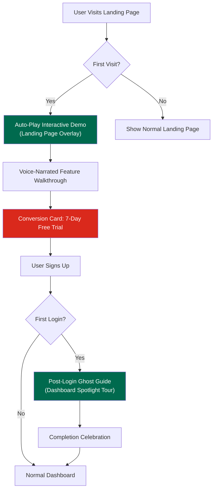

# PoribarGuard — Interactive Guided Onboarding Experience (IGO)

**Project**: PoribarGuard (fsafe.com)  
**Date**: 11 May 2026  
**Version**: 1.0 — Final Specification  
**Status**: Ready for Implementation  

---

## Table of Contents

1. [Mission & Objective](#1-mission--objective)
2. [System Architecture Overview](#2-system-architecture-overview)
3. [Part 1 — Landing Page Interactive Demo](#3-part-1--landing-page-interactive-demo)
4. [Part 2 — Post-Login Ghost Guide (Onboarding Tour)](#4-part-2--post-login-ghost-guide)
5. [Part 3 — Bengali Voice-Over Engine](#5-part-3--bengali-voice-over-engine)
6. [Part 4 — Animations, Micro-Interactions & Visual Effects](#6-part-4--animations-micro-interactions--visual-effects)
7. [Part 5 — Logic, Persistence & Smart Triggers](#7-part-5--logic-persistence--smart-triggers)
8. [Part 6 — Conversion Bridge & Trust Finale](#8-part-6--conversion-bridge--trust-finale)
9. [Technical Implementation Guide](#9-technical-implementation-guide)
10. [Component & File Map](#10-component--file-map)

---

## 1. Mission & Objective

### Problem Statement

PoribarGuard's target users — Bangladeshi expatriate parents — are **not tech-savvy**. Features like *Screen View*, *Front Camera*, and *Ambient Audio* are unfamiliar concepts. Traditional landing pages with text-heavy explanations fail to communicate value to this audience. Users won't read lengthy feature descriptions, and they don't have time to explore on their own.

### Solution

Build a **two-layer Interactive Guided Onboarding (IGO)** system:

| Layer | When | Where | Purpose |
|-------|------|-------|---------|
| **Landing Page Demo** | Before signup | Landing page hero section | Show what the app does via an immersive, voice-narrated interactive walkthrough. Answer "Why should I sign up?" |
| **Post-Login Ghost Guide** | After first login | Dashboard | Teach how to use each feature with a spotlight-based guided tour. Answer "How do I use this?" |

### Design Philosophy

> The user should feel like the app is **personally talking to them** and **guiding them by the hand**. Every micro-detail must feel premium, smooth, and emotionally resonant. Nothing generic — every interaction must feel world-class.

---

## 2. System Architecture Overview



---

## 3. Part 1 — Landing Page Interactive Demo

> **Goal**: Before the user even creates an account, show them exactly what PoribarGuard can do through an immersive, cinematic demo experience overlaid on the landing page.

### 3.1 Auto-Play Intro (The Hook)

| Property | Specification |
|----------|--------------|
| **Trigger** | 2–3 seconds after landing page fully loads |
| **Visual** | A premium mockup phone fades in at center-right. Behind it, a subtle ambient background evokes a probashi setting (e.g., Riyadh cityscape blended with a Bangladeshi village) |
| **Voice** | Auto-plays (muted by default with unmute prompt). Bengali voice says: *"আপনি দূরে থাকেন, কিন্তু আপনার দুশ্চিন্তা কি দেশেই পড়ে থাকে?"* |
| **Unmute UX** | A pulsing speaker icon with text: *"🔊 শুনুন"* — tap to unmute |

### 3.2 Hero Spotlight Overlay

- The hero section gradually dims with a **glassmorphic dark overlay** (`backdrop-filter: blur(12px)`, `background: rgba(0,0,0,0.6)`).
- A **simulated app interface** appears inside the mockup phone — not real data, but a beautifully designed mock of the dashboard.
- The Ghost Guide spotlight system activates on top of this overlay.

### 3.3 Benefit-Focused Voice Narration

> [!IMPORTANT]
> The voice script focuses on **benefits**, not technical features. We speak the user's emotional language.

| Feature | Voice Script (Bengali) |
|---------|----------------------|
| **Screen View** | *"আপনার অনুপস্থিতিতে আপনার সন্তান মোবাইলে খারাপ কিছু দেখছে কি না, তা এখন আপনি সরাসরি নিজের ফোনে দেখতে পাবেন।"* |
| **Ambient Mic** | *"বাড়ির পরিবেশ কেমন, বা সে কার সাথে কথা বলছে—তা শুনতে পাবেন এক ক্লিকেই।"* |
| **Location** | *"রাত হয়ে গেলেও সন্তান ঘরে ফিরলো কি না, তা নিয়ে আর দুশ্চিন্তা করতে হবে না।"* |
| **Camera** | *"নিচের ক্যামেরা আইকনটিতে ক্লিক করে দেখুন তো আপনার সন্তান এখন কী করছে?"* |

### 3.4 Interactive Voice Trigger

The demo is **not passive**. At one point, the voice prompts the user to click:

1. Voice says: *"নিচের ক্যামেরা আইকনটিতে ক্লিক করে দেখুন..."*
2. Camera icon pulses with **neon green glow ripple**
3. User clicks → **Success Sound** plays + voice says: *"চমৎকার! এভাবেই আপনি আপনার পরিবারকে আগলে রাখতে পারবেন।"*

### 3.5 The "Magic Mirror" Effect

When a user clicks a feature button during the demo:

| Feature | Mockup Phone Reaction |
|---------|----------------------|
| **Screen View** | Phone screen transitions from blurred → clear, showing a simulated child screen. Digital *signal waves* overlay animate across the screen. |
| **Camera** | Background subtly shifts to a home environment ambiance |
| **Location** | Background shows a faint digital map graphic |

### 3.6 Navigation Controls

| Control | Position | Style |
|---------|----------|-------|
| **Skip Demo & Join Now** | Top-right corner | Semi-transparent, elegant pill button |
| **Mute/Unmute** | Bottom-left | Pulsing speaker icon |
| **Progress Bar** | Top edge | Instagram story-style segmented bar |

---

## 4. Part 2 — Post-Login Ghost Guide

> **Goal**: After account creation, teach the user how to use each dashboard feature through a spotlight-based, voice-assisted interactive tour.

### 4.1 Visual Guidance Engine (The Spotlight System)

#### Frosted Glass Overlay
- Full-screen overlay using `backdrop-filter: blur(8px)` with dark glassmorphism
- Background content visible but dimmed — creates focus without disorientation

#### Dynamic Spotlight
- Only the active button/feature is **highlighted above the blur layer**
- Spotlight is not a hard circle — it's a **soft luminous glow** that radiates gentle light from the button's edges
- Glow color: matches the app's primary palette (`#006A4E` green with soft white edge)

#### Breathing Animation
- Highlighted button slowly pulses (scale `1.0 → 1.05 → 1.0`) over 2-second cycle
- Creates the illusion that the button is "breathing" — draws attention naturally

### 4.2 Transitions (Spring Physics)

| Behavior | Specification |
|----------|--------------|
| **Spotlight Movement** | When user taps "Next", the spotlight **slides smoothly** from one button to the next (not jump-cut) |
| **Spring Motion** | Use spring physics (e.g., `framer-motion` spring). Spotlight slightly overshoots target position then settles with a micro-bounce. Creates organic, natural feel |
| **Duration** | 400–600ms per transition |
| **Easing** | `spring({ stiffness: 300, damping: 25 })` |

### 4.3 Progress Tracking (Story-Style Bar)

- Thin segmented progress bar at the **top of the screen** (Instagram/Facebook Stories style)
- Segments = number of features in the guide (e.g., 4 features = 4 segments)
- Current segment fills with animated gradient as the voice narration plays
- Completed segments remain filled with solid color

### 4.4 Minimalist Hand Gesture (The Visual Guide)

- A **stylish, minimalist animated hand/pointer** appears near the highlighted button
- The hand gently performs a "tap" gesture animation — tells users "click here" without words
- Movement is smooth and organic, not robotic
- Built with Lottie animation for lightweight, scalable quality

---

## 5. Part 3 — Bengali Voice-Over Engine

### 5.1 Voice Persona (The Bengali Companion)

| Property | Specification |
|----------|--------------|
| **Language** | Simple, conversational Bengali (সহজ প্রাঞ্জল বাংলা) |
| **Tone** | Soft, natural, warm, trustworthy — like a caring friend |
| **Quality** | Professional voice artist OR high-quality AI TTS (no robotic tone) |
| **Opening** | *"স্বাগতম! আমি আপনাকে শিখিয়ে দেব পরিবার গার্ড কীভাবে ব্যবহার করতে হয়।"* |

### 5.2 Trigger-Based Audio Playback

- Audio briefings are **synchronized with the spotlight** — when the spotlight moves to a new feature, the corresponding audio begins automatically
- Each feature has its own dedicated audio file

### 5.3 Audio Ducking (Smart Volume Management)

| Event | Background Volume | Voice Volume |
|-------|-------------------|-------------|
| Voice starts | Drops to **20–30%** | **100%** |
| Voice ends | Fades back to **100%** over 500ms | — |
| Transition between features | **50%** | — |

### 5.4 Audio Queue Management

- Audio files **never overlap** — strict sequential playback
- Minimum **500ms gap** between consecutive audio clips
- If user taps "Next" before audio finishes, current audio fades out gracefully (300ms fade)

### 5.5 Synchronized Dynamic Subtitles

| Property | Specification |
|----------|--------------|
| **Position** | Bottom of screen, above navigation controls |
| **Font** | Hind Siliguri (premium Bengali web font) |
| **Animation** | Typewriter effect OR word-by-word fade-in, synchronized with voice |
| **Background** | Semi-transparent dark pill (`rgba(0,0,0,0.7)`, `border-radius: 20px`) |
| **Dismissible** | User can toggle subtitles on/off via a small "CC" button |

---

## 6. Part 4 — Animations, Micro-Interactions & Visual Effects

### 6.1 Lottie Icon Animations

Each feature icon comes alive when highlighted:

| Feature Icon | Animation |
|-------------|-----------|
| **Camera** | Lens rotates slowly (focusing effect) + a subtle sheen/reflection sweeps across |
| **Ambient Mic** | Sound wave ripples emit outward from the icon |
| **Screen View** | Data stream flows inside a miniature phone frame (loop) |
| **Location** | Pin drops with a bounce + radar pulse emanates from center |

### 6.2 Button Visual Cues

#### Glow Ripple
- Active button emits soft **neon green ripple waves** (`box-shadow` animation expanding outward)
- Communicates: *"It's your turn to tap this"*

#### Magnetic Hover (Desktop)
- When cursor approaches the highlighted button (within ~30px), the button subtly shifts toward the cursor
- Creates premium "magnetic" feel
- Implementation: track cursor position, apply small `transform: translate()` offset

### 6.3 Light Trail Transitions

- When the demo moves from one feature to another, a thin **luminous light trail** travels from the previous button to the next
- Trail color: soft white or brand green gradient
- Duration: synchronized with spotlight transition (~500ms)

### 6.4 Success Feedback Animations

| Event | Animation |
|-------|-----------|
| **User taps correct button** | Green checkmark blooms with spring animation + "pop" sound |
| **Completing a step** | Progress segment fills with shimmer effect |
| **Completing entire guide** | Subtle golden/neon confetti burst (3-second duration, not overwhelming) |

### 6.5 Responsive Dynamic Background (Landing Demo Only)

- Background subtly shifts to match the feature being demonstrated:
  - **Camera demo** → warm home-environment ambient tones
  - **Location demo** → faint digital map graphics emerge
  - **Mic demo** → subtle audio waveform pattern in background
- Transitions: slow cross-fade (800ms–1200ms)

### 6.6 Sound Effects & Haptics

| Interaction | Sound | Haptic |
|-------------|-------|--------|
| **Next button tap** | Soft "pop" (high-quality, 50ms) | Light tap feedback |
| **Feature highlight** | Subtle "ding" chime | Short "tick" vibration |
| **Success/Correct action** | Satisfying "success" tone | Medium pulse |
| **Guide completion** | Achievement jingle (2s) | Double pulse pattern |
| **Skip** | Soft "whoosh" | None |

> [!NOTE]
> Haptic feedback is only available on mobile devices that support the Vibration API. Degrade gracefully on unsupported devices.

---

## 7. Part 5 — Logic, Persistence & Smart Triggers

### 7.1 First-Run Detection

```
Landing Page Demo:
  → Check localStorage: `poribar_demo_seen = true/false`
  → If false → Auto-trigger demo after 2–3 second delay
  → If true → Show normal landing page

Post-Login Guide:
  → Check database/API: `user.onboarding_completed = true/false`
  → If false → Auto-trigger Ghost Guide on dashboard load
  → If true → Show normal dashboard
```

### 7.2 Exit Strategy

#### Skip Button
- Position: top-right corner
- Style: semi-transparent, elegant, non-intrusive
- Text: "এড়িয়ে যান" (Skip)

#### Seamless Exit Animation
- On skip: spotlight and overlay **fade out smoothly** (500ms ease-out)
- No jarring disappearance — everything dissolves gracefully

### 7.3 On-Demand Help (The "?" Bubble)

- After guide completion, a **small pulsing "?" icon** floats in the bottom-right corner of the dashboard
- Tapping it re-triggers the full voice-guided tour from the beginning
- Acts as a permanent safety net — user always knows help is available
- Pulse animation: gentle breathing glow (matches brand green)

### 7.4 Intelligent Resume

- If the guide is interrupted (incoming call, app closed, browser tab switched):
  - Save current step index to `localStorage` / database
  - On next visit, prompt: *"আপনি গত বার ধাপ ৩-এ ছিলেন। সেখান থেকে শুরু করবেন?"*
  - Options: **"হ্যাঁ, চালিয়ে যান"** / **"শুরু থেকে দেখুন"**

### 7.5 Final Success Message (Elite Closing)

After all guide steps complete:

- Premium animated card slides in from bottom
- Text: ***"অভিনন্দন! আপনি এখন পরিবার গার্ড ব্যবহার করতে সম্পূর্ণ প্রস্তুত।"***
- Subtle golden confetti animation (3 seconds)
- Card auto-dismisses after 5 seconds OR on tap

---

## 8. Part 6 — Conversion Bridge & Trust Finale

> **Goal**: Seamlessly convert demo viewers into signups.

### 8.1 Grand Finale (Landing Demo)

- After all features are demonstrated, the mockup phone emits a **golden aura** glow
- Voice delivers the closing emotional punch:
  > *"আর দুশ্চিন্তা নয়, এবার নিশ্চিন্তে কাজ করুন প্রবাসে। আপনার পরিবারের সুরক্ষায় আজই যুক্ত হোন পরিবার গার্ডের সাথে।"*

### 8.2 Conversion Card (Magnetic CTA)

| Element | Specification |
|---------|--------------|
| **Card Style** | Premium glassmorphic card, slides up from bottom with spring animation |
| **Headline** | **"৭ দিনের ফ্রি ট্রায়াল শুরু করুন—কোনো কার্ড লাগবে না।"** |
| **CTA Button** | Large, green, pulsing glow. Text: **"এখনই শুরু করুন"** |
| **Social Proof** | Below button: *"ইতিমধ্যেই ১০,০০০+ পরিবার আমাদের ওপর আস্থা রেখেছে।"* |

### 8.3 Landing Page Unlock (Post-Demo)

- Demo overlay and spotlight **smoothly fade away** (800ms)
- Full landing page returns to normal brightness
- User can scroll down to read more details, pricing, testimonials
- **Floating CTA button** persists in bottom-right corner during scroll

### 8.4 Trust Badges & Social Proof (Below Demo Area)

Animated icon badges immediately below the demo section:

- 🔒 *"১০০% নিরাপদ ডাটা এনক্রিপশন"*
- 📞 *"২৪/৭ কাস্টমার সাপোর্ট"*
- 💳 *"বাংলাদেশি পেমেন্ট মেথড সাপোর্ট (bKash, Nagad)"*

---

## 9. Technical Implementation Guide

### 9.1 Technology Stack

| Layer | Technology |
|-------|-----------|
| **Framework** | Next.js (existing project) |
| **Animations** | Framer Motion (spring physics, layout animations) |
| **Icon Animations** | Lottie (via `lottie-react` or `@lottiefiles/react-lottie-player`) |
| **Audio** | Howler.js (audio queue, ducking, cross-fade) |
| **Voice TTS** | Pre-recorded Bengali audio files (MP3/OGG) stored in `/public/audio/` |
| **Subtitles** | Custom component with timed text data (JSON/SRT format) |
| **Haptics** | Web Vibration API (`navigator.vibrate()`) |
| **Persistence** | `localStorage` for landing demo, Prisma/DB for post-login state |
| **Styling** | CSS Modules + CSS custom properties for theming |

### 9.2 Audio File Structure

```
public/
  audio/
    guide/
      welcome.mp3              ← Opening greeting
      screen-view.mp3           ← Screen View benefit narration
      ambient-mic.mp3           ← Ambient Mic benefit narration
      front-camera.mp3          ← Camera benefit narration
      location.mp3              ← Location benefit narration
      success.mp3               ← "চমৎকার!" confirmation
      closing.mp3               ← Final emotional CTA narration
      completion.mp3            ← "অভিনন্দন!" celebration
    sfx/
      pop.mp3                   ← Button tap sound
      ding.mp3                  ← Feature highlight chime
      success-tone.mp3          ← Correct action tone
      achievement.mp3           ← Guide completion jingle
      whoosh.mp3                ← Skip sound
    bgm/
      ambient-soft.mp3          ← Background instrumental (loop)
```

### 9.3 Subtitle Data Format

```json
{
  "screen-view": {
    "audio": "/audio/guide/screen-view.mp3",
    "duration": 8500,
    "segments": [
      { "text": "আপনার অনুপস্থিতিতে", "start": 0, "end": 1200 },
      { "text": "আপনার সন্তান মোবাইলে", "start": 1200, "end": 2400 },
      { "text": "খারাপ কিছু দেখছে কি না,", "start": 2400, "end": 3800 },
      { "text": "তা এখন আপনি সরাসরি", "start": 3800, "end": 5200 },
      { "text": "নিজের ফোনে দেখতে পাবেন।", "start": 5200, "end": 6800 }
    ]
  }
}
```

### 9.4 Performance Requirements

| Metric | Target |
|--------|--------|
| Total audio payload (initial) | < 2MB (lazy-load remaining) |
| Lottie animation files | < 100KB each |
| Overlay render impact | < 5ms frame time |
| Transition frame rate | 60fps minimum |
| Time to interactive (demo) | < 3 seconds after page load |

### 9.5 Accessibility & Fallbacks

| Scenario | Fallback |
|----------|----------|
| Audio muted / blocked by browser | Subtitles enabled by default + visual-only mode |
| No Vibration API support | Skip haptics silently |
| Slow connection | Preload first 2 audio clips, lazy-load rest |
| Screen reader active | ARIA labels on all interactive elements + skip-to-content link |
| Reduced motion preference | Disable spring animations, use simple opacity transitions |

---

## 10. Component & File Map

### New Components to Create

```
src/components/
  onboarding/
    LandingDemo.jsx              ← Landing page interactive demo orchestrator
    GhostGuide.jsx               ← Post-login spotlight tour orchestrator
    SpotlightOverlay.jsx         ← Glassmorphic overlay + dynamic spotlight
    VoiceEngine.jsx              ← Audio playback, ducking, queue management
    SubtitleDisplay.jsx          ← Synchronized Bengali subtitles
    ProgressBar.jsx              ← Story-style segmented progress bar
    HandPointer.jsx              ← Animated hand gesture (Lottie)
    FeatureIconAnimated.jsx      ← Lottie-powered feature icon animations
    ConversionCard.jsx           ← Post-demo signup CTA card
    HelpBubble.jsx               ← Floating "?" re-trigger button
    SuccessCelebration.jsx       ← Confetti + completion card
    MockupPhone.jsx              ← Simulated phone with "Magic Mirror" screens
```

### Modified Existing Components

| File | Modification |
|------|-------------|
| `src/components/landing/Hero.jsx` | Integrate `LandingDemo` overlay trigger |
| `src/components/landing/LiveDemo.jsx` | Connect with `MockupPhone` for interactive demo |
| `src/app/[locale]/dashboard/page.js` | Add `GhostGuide` trigger on first login |
| `src/components/dashboard/` | Wrap feature buttons with spotlight-targetable refs |

### Data & Configuration

```
src/data/
  onboarding-steps.json          ← Guide step definitions (order, targets, audio refs)
  subtitle-tracks.json           ← Timed subtitle segments per feature
  
public/audio/                    ← All audio assets (structure per §9.2)
public/lottie/                   ← Lottie animation JSON files
```

---

> [!TIP]
> **Implementation Priority**: Start with the Post-Login Ghost Guide (simpler scope, fewer dependencies), then build the Landing Page Demo using the same shared components (SpotlightOverlay, VoiceEngine, SubtitleDisplay).
